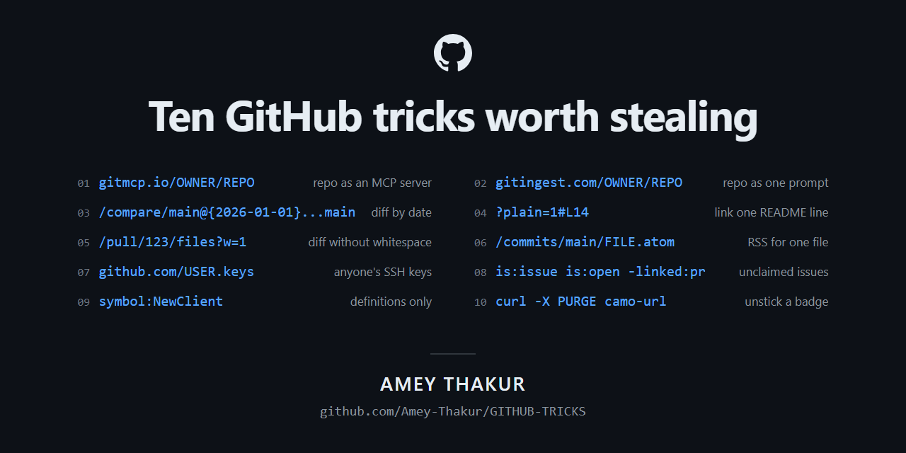
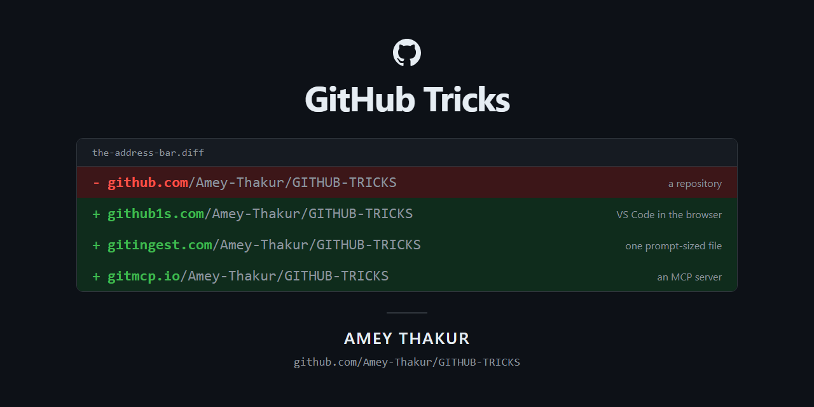
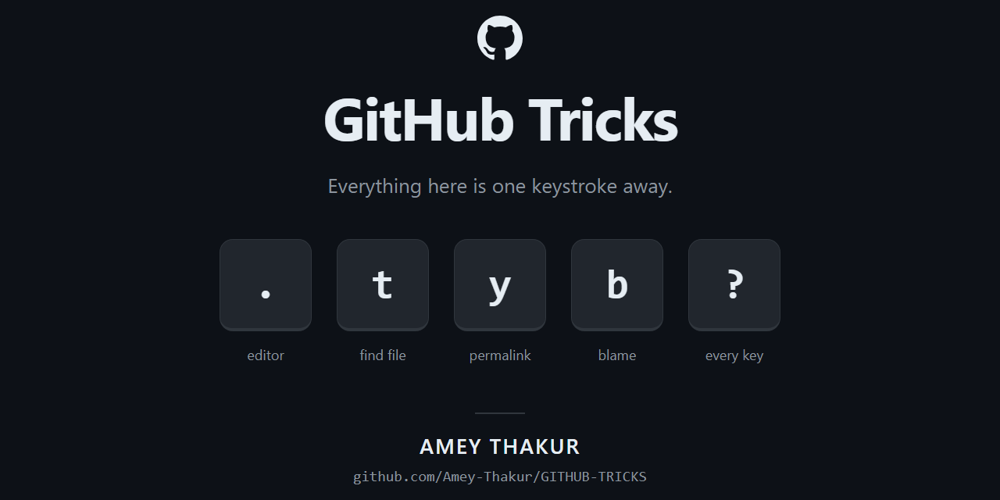
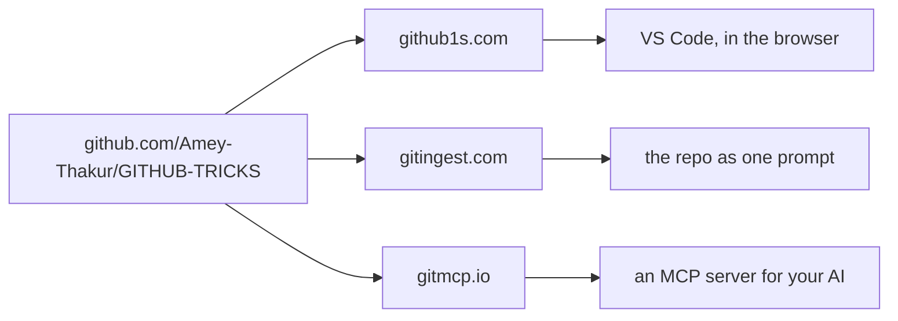
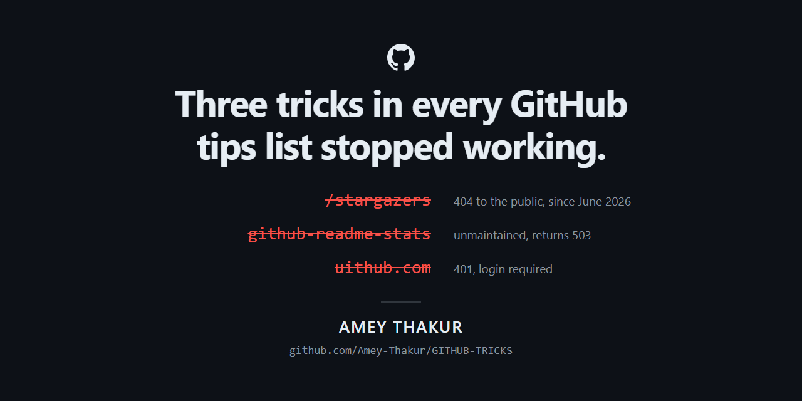

<div align="center">

<picture>
  <source media="(prefers-color-scheme: dark)" srcset=".github/assets/github-mark-dark.svg">
  
</picture>

# GitHub Tricks

**The GitHub you did not know you had.**

<br>

[](LICENSE)
[](#start-here)
[](#contributing)
[](https://github.com/Amey-Thakur)

<br>

<table>
  <tr><td align="left"><b>Start here</b></td><td align="left"><a href="#start-here">The ten that surprise everyone</a></td></tr>
  <tr><td align="left"><b>Browse</b></td><td align="left"><a href="#one-word-swaps">One-word swaps</a> &nbsp;&middot;&nbsp; <a href="#urls">URLs</a> &nbsp;&middot;&nbsp; <a href="#keyboard">Keyboard</a> &nbsp;&middot;&nbsp; <a href="#search">Search</a></td></tr>
  <tr><td align="left"><b>Build</b></td><td align="left"><a href="#repository">Repository</a> &nbsp;&middot;&nbsp; <a href="#actions">Actions</a> &nbsp;&middot;&nbsp; <a href="#security">Security</a></td></tr>
  <tr><td align="left"><b>Write</b></td><td align="left"><a href="#markdown">Markdown</a> &nbsp;&middot;&nbsp; <a href="#profile">Profile</a></td></tr>
  <tr><td align="left"><b>Automate</b></td><td align="left"><a href="#the-gh-cli">gh CLI</a> &nbsp;&middot;&nbsp; <a href="#the-api">API</a> &nbsp;&middot;&nbsp; <a href="#git">Git</a></td></tr>
  <tr><td align="left"><b>Run</b></td><td align="left"><a href="#codespaces">Codespaces</a> &nbsp;&middot;&nbsp; <a href="#copilot">Copilot</a></td></tr>
  <tr><td align="left"><b>Reference</b></td><td align="left"><a href="#dead-tricks">Dead tricks</a> &nbsp;&middot;&nbsp; <a href="#share-it">Share it</a> &nbsp;&middot;&nbsp; <a href="#contributing">Contributing</a></td></tr>
</table>

<br>

*Hover any code block and a copy button appears, top right.*

</div>

---

## Start here

Ten that surprise almost everyone. Click any one and watch it work.

> [!TIP]
> **How to read this page.**
>
> | You see | It means |
> |---|---|
> | `Amey-Thakur/GITHUB-TRICKS` | This repository, used as a live demo. Replace it with your own `owner/repo` |
> | `cli/cli` | Someone else's busy repository, used where a trick needs real history to show anything |
> | `OWNER`, `REPO`, `USERNAME`, `BRANCH`, `SHA`, `PATH`, and anything else in CAPITALS | A placeholder. **These always need replacing** |
> | `{owner}`, `{repo}` in a `gh` command | **Not** placeholders. Type them literally; `gh` fills them in from the repository you are standing in |
>
> Every link is live, and every block in [Start here](#start-here) runs exactly as written.

<div align="center">



</div>

<br>

**1. Turn any repository into a server your AI can read.** Nothing to install.

```
https://gitmcp.io/Amey-Thakur/GITHUB-TRICKS
```

[Open it](https://gitmcp.io/Amey-Thakur/GITHUB-TRICKS) &nbsp;·&nbsp; swap in any `owner/repo`

<br>

**2. Get a whole codebase as one text file**, sized for a prompt.

```
https://gitingest.com/Amey-Thakur/GITHUB-TRICKS
```

[Open it](https://gitingest.com/Amey-Thakur/GITHUB-TRICKS) &nbsp;·&nbsp; swap in any `owner/repo`

<br>

**3. See what changed in January**, on a repository you have never cloned.

```
https://github.com/cli/cli/compare/trunk@{2026-01-01}...trunk@{2026-02-01}
```

[Open it on cli/cli](https://github.com/cli/cli/compare/trunk@%7B2026-01-01%7D...trunk@%7B2026-02-01%7D) &nbsp;·&nbsp; a busy repo shows it best

> [!NOTE]
> Undocumented, and unlike local Git it needs no reflog: GitHub resolves the date server-side. Encode the braces as `%7B` and `%7D` in scripts.

<br>

**4. Link to one line of a README.** Line anchors do nothing without `?plain=1`.

```
https://github.com/Amey-Thakur/GITHUB-TRICKS/blob/main/README.md?plain=1#L14
```

[Open it](https://github.com/Amey-Thakur/GITHUB-TRICKS/blob/main/README.md?plain=1#L14) &nbsp;·&nbsp; lands on line 14 of this file

<br>

**5. Read a diff without the reindentation noise.**

```
https://github.com/cli/cli/pull/9000/files?w=1
```

[Open it on cli/cli](https://github.com/cli/cli/pull/9000/files?w=1) &nbsp;·&nbsp; any pull request will do

<br>

> [!TIP]
> Five of the ten below run on this repository, so the link and the copy block are the same working URL. Swap the owner and repo for your own and they keep working.

**6. Subscribe to a single file.** RSS for one path, not the whole repository.

```
https://github.com/Amey-Thakur/GITHUB-TRICKS/commits/main/README.md.atom
```

[Open it](https://github.com/Amey-Thakur/GITHUB-TRICKS/commits/main/README.md.atom) &nbsp;·&nbsp; a feed for one file, not the repo

<br>

**7. Take anyone's public SSH keys**, ready for `authorized_keys`.

```
https://github.com/Amey-Thakur.keys
```

[Open it](https://github.com/Amey-Thakur.keys) &nbsp;·&nbsp; swap in any username

<br>

**8. Find work nobody has claimed.** Open issues with no pull request attached.

```
is:issue is:open -linked:pr
```

[Open it on cli/cli](https://github.com/cli/cli/issues?q=is%3Aissue+is%3Aopen+-linked%3Apr) &nbsp;·&nbsp; 400+ unclaimed issues right now

<br>

**9. Search definitions only**, instead of four hundred call sites.

```
symbol:NewClient
```

[Open it](https://github.com/search?q=symbol%3ANewClient&type=code) &nbsp;·&nbsp; needs a signed-in GitHub session

<br>

**10. Unstick a badge that will not refresh.** GitHub proxies every external image through camo and caches it.

```bash
curl -X PURGE https://camo.githubusercontent.com/HASH
```

> [!TIP]
> Right-click the stale badge and copy its image address to get the camo URL.

<br>

> [!IMPORTANT]
> `/stargazers` now returns 404 to the public, `github-readme-stats` is unmaintained, and `uithub.com` demands a login. [Everything else that quietly died](#dead-tricks).

<br>

---

<div align="center">

# Browse

**moving around the site itself**

<sub>`CAPITALS` are placeholders to replace &nbsp;·&nbsp; `Amey-Thakur/GITHUB-TRICKS` is this repository, swap in your own &nbsp;·&nbsp; `{owner}` in a `gh` command is literal</sub>

</div>

## One-word swaps

Change one word in the address bar. Same repository, entirely different thing.
Every hostname below is a live link, pointed at this repository. Copy any of them and change the last two path segments.

<div align="center">

`github.com/owner/repo` &nbsp;→&nbsp; `github`**`1s`**`.com/owner/repo`

</div>

<br>

<div align="center">



</div>

<br>

| Swap to | You get | Catch |
|---|---|---|
| [`github1s.com`](https://github1s.com/Amey-Thakur/GITHUB-TRICKS) | VS Code in the browser | Read-only. Private repos need a pasted token |
| [`github.dev`](https://github.dev/Amey-Thakur/GITHUB-TRICKS) | The same editor, with write access | No terminal, no builds. Press <kbd>.</kbd> from any repo |
| [`gitingest.com`](https://gitingest.com/Amey-Thakur/GITHUB-TRICKS) | The repository as one prompt-sized file | Silently skips files over 50 kB |
| [`gitmcp.io`](https://gitmcp.io/Amey-Thakur/GITHUB-TRICKS) | An MCP server for your AI | `gitmcp.io/docs` floats to any repo. Scope it |
| [`deepwiki.com`](https://deepwiki.com/Amey-Thakur/GITHUB-TRICKS) | A generated wiki, with its own MCP | Public repositories only |
| [`gitdiagram.com`](https://gitdiagram.com/Amey-Thakur/GITHUB-TRICKS) | An architecture diagram | An LLM reading the file tree, not import analysis |
| [`gitreverse.com`](https://gitreverse.com/Amey-Thakur/GITHUB-TRICKS) | A "build this from scratch" prompt | Reads the README and metadata only |
| [`forgithub.com`](https://forgithub.com/Amey-Thakur/GITHUB-TRICKS) | The index of every swap tool | Unmaintained. Two of its entries are dead |

<br>

## URLs

### Diffs and patches

```
/pull/123.diff                      plain unified diff
/pull/123.patch                     mbox series, replays with git am
/pull/123/files?w=1                 hide whitespace-only changes
/commit/SHA?diff=split              side by side
/compare/v1.0.0...v2.0.0.patch      a range the web page refuses to render
/compare/main...OTHER_OWNER:main    across forks
/compare/SHA~5...SHA                a commit against five before it
```

[A patch series](https://github.com/cli/cli/pull/9000.patch) &nbsp;·&nbsp; [Split view](https://github.com/cli/cli/commit/HEAD?diff=split)

> [!WARNING]
> **`A...B` is not `A..B`.** Three dots diff from the merge base, which is what a pull request shows. Two dots diff the current tips, so the answer changes whenever the base branch moves. Say which one you used when you paste a compare link into a bug report.

<br>

> [!TIP]
> `.diff` gives you one combined diff. `.patch` gives you the commits, so `git am` replays them with their messages and authors intact. Reach for `.patch` when you want history, `.diff` when you want to read.

### Files, lines and blame

```
/blob/REF/README.md?plain=1                 line numbers on rendered Markdown
/blob/REF/PATH#L10-L20                      highlight a range
/blame/REF/PATH                             blame, or press b
/find/BRANCH                                the file finder, or press t
raw.githubusercontent.com/O/R/SHA/PATH      raw, immutable, uncached
```

[Blame a file](https://github.com/cli/cli/blame/trunk/README.md) &nbsp;·&nbsp; [Open the file finder](https://github.com/cli/cli/find/trunk)

> [!CAUTION]
> A raw URL carrying a **branch** name is cached about five minutes, so a fresh push looks like it did nothing. Swap in the commit SHA and it is immutable and instant.

> [!NOTE]
> The file finder hides `.git`, `.hg`, `.sass-cache`, `.svn`, `build`, `dot_git`, `log`, `tmp` and `vendor`, so a file you know exists can look missing. Blame hides anything in `.git-blame-ignore-revs`; append `~` to the SHA in the URL to see past it.

<br>

### Downloads, feeds and identity

```
/archive/refs/heads/BRANCH.tar.gz     any branch as a tarball
/archive/refs/tags/TAG.zip            any tag, slashes included
/releases/latest/download/tool.zip    always the newest release asset
/commits/main/README.md.atom          RSS for one file
/releases.atom  /tags.atom  /discussions.atom
github.com/USERNAME.keys              public SSH keys
github.com/USERNAME.gpg               public PGP key
github.com/USERNAME.png?size=100      avatar, any size
```

[Releases feed](https://github.com/cli/cli/releases.atom) &nbsp;·&nbsp; [Latest release](https://github.com/cli/cli/releases/latest) &nbsp;·&nbsp; [An avatar](https://github.com/Amey-Thakur.png?size=100)

> [!NOTE]
> `.gpg` never 404s. An account with no key returns a well-formed but empty armored block, so check the body rather than the status code. Archive URLs redirect to `codeload.github.com`, which strict firewalls block.

<br>

### Two hidden repositories

```bash
git clone https://github.com/OWNER/REPO.wiki.git    # the wiki is its own repo
git fetch origin pull/123/head:pr-123               # any PR, including closed ones
```

> [!WARNING]
> A wiki is never in a clone and never in an archive download. Backing up the repository does not back up the wiki.

<br>

### Prefilled forms

```
/issues/new?title=Bug&body=Steps&labels=bug&assignees=octocat
/compare/main...branch?quick_pull=1&title=Fix&template=release.md
/releases/new?tag=v1.0.1&title=v1.0.1&prerelease=1
/commits/main?author=USERNAME&since=2025-01-01&until=2025-01-08
```

> [!CAUTION]
> Permission is checked per parameter, and failure is all-or-nothing. One parameter you lack rights for turns the whole URL into a 404 rather than a partly filled form.

<br>

## Keyboard

<div align="center">



</div>

<br>

| Key | Does | Worth knowing |
|---|---|---|
| <kbd>?</kbd> | Shortcuts for the page you are on | The docs list only some. The dialog is the authority |
| <kbd>t</kbd> | Fuzzy file finder | Hides nine directories |
| <kbd>y</kbd> | Rewrites a branch URL to a permalink | No confirmation, no reload |
| <kbd>.</kbd> | Opens github.dev | <kbd>></kbd> opens it in a new tab |
| <kbd>b</kbd> | Blame | |
| <kbd>l</kbd> | Label filter | <kbd>Alt</kbd> + click a label to **exclude** it |
| <kbd>r</kbd> | Quotes the selected text in a reply | Appends, so repeats stack |
| <kbd>Alt</kbd> <kbd>↑</kbd> | Moves focus **into** a hovercard | The only keyboard route to one |
| <kbd>Ctrl</kbd> <kbd>.</kbd> | Saved replies, then <kbd>Ctrl</kbd> <kbd>N</kbd> | Max 100, personal, not shareable |
| <kbd>Ctrl</kbd> <kbd>G</kbd> | Suggestion block from the selected lines | Extra lines get deleted when applied |
| <kbd>g</kbd> then <kbd>c</kbd> <kbd>i</kbd> <kbd>p</kbd> <kbd>a</kbd> <kbd>s</kbd> | Code, Issues, PRs, Actions, Security | <kbd>g</kbd> <kbd>s</kbd> is Security, never Settings |
| <kbd>Shift</kbd> <kbd>T</kbd> | Timestamps in Actions logs | Off by default, so long waits are invisible |
| <kbd>e</kbd> | Archives the selection in Projects | **No confirmation.** Takes the whole selection |

**Two modifier clicks nobody documents.** <kbd>Alt</kbd> + click a file's caret collapses *every* diff in the pull request. <kbd>Alt</kbd> + click a resolved thread toggles *all* outdated threads.

> [!TIP]
> Turn the lot off at [github.com/settings/accessibility](https://github.com/settings/accessibility) by deselecting "Character keys". Modifier shortcuts keep working.

<br>

## Search

### Code

```
/sparse.*index/                regex, no look-around, escape every slash
/(?-i)True/                    case-sensitive, which is not the default
symbol:NewClient               definitions only, never call sites
path:/src/**/*.js              anchored glob
content:README.md              the text, not the filename
NOT is:fork                    drop forks
```

[Run a symbol search](https://github.com/search?q=symbol%3ANewClient&type=code)

> [!IMPORTANT]
> An absent result never proves the code is absent. Code search skips every branch except the default one, files over 350 KiB, any file with a line over 4,096 bytes, and non-UTF-8 files. Results stop at 100, and quoting a `path:` value silently disables globbing.

<br>

### Issues and pull requests

```
is:issue is:open -linked:pr           nobody is working on these
reason:completed                      closed as done
reason:"not planned"                  closed as abandoned
user-review-requested:@me             asked of you, not of your team
no:label no:assignee no:milestone     untriaged
type:"Bug"  field.Priority:High       issue types and fields
archived:false                        skip archived repositories
interactions:>2000                    reactions plus comments
sort:reactions-+1                     ranked by thumbs up
```

[See unclaimed issues](https://github.com/cli/cli/issues?q=is%3Aissue+is%3Aopen+-linked%3Apr)

> [!WARNING]
> `label:a,b` means **or**. `label:a label:b` means **and**. Nothing on screen tells you which you built. Closing an issue as *duplicate* matches neither `reason:completed` nor `reason:"not planned"`, so two-bucket queries lose them silently.

<br>

### Repositories and commits

```
topics:>3                        by topic count, not topic: name
size:1000..2000                  kilobytes, not megabytes
org:ORGNAME props.production:true   organisation custom properties
parent:SHA                       a commit's children
merge:true                       merge commits only
saved:                           type this in the search bar for saved queries
```

> [!NOTE]
> Every search API result set stops at 1,000. When a query times out the API returns `incomplete_results: true` **with a 200 status**, so a partial answer looks complete.

<br>

---

<div align="center">

# Build

**your repository, and what it does behind your back**

<sub>`CAPITALS` are placeholders to replace &nbsp;·&nbsp; `Amey-Thakur/GITHUB-TRICKS` is this repository, swap in your own &nbsp;·&nbsp; `{owner}` in a `gh` command is literal</sub>

</div>

## Repository

### CODEOWNERS, and the four rules that quietly break it

```
/docs/     @team     recursive
docs/*     @team     ONE level deep, and nothing warns you
```

> [!CAUTION]
> **Last match wins, not most specific.** A `* @org/everyone` catch-all at the bottom, which reads like a sensible fallback, disables every rule above it.
>
> Invalid lines are skipped silently. A team without write access is dropped silently. The file is read from the **base** branch, so a pull request that adds itself as an owner cannot apply that rule to itself.

<br>

### Merging

> [!CAUTION]
> **A required check skipped by path filtering blocks the pull request forever.** Skipped is not passed, and no timeout converts one into the other. Fix it with a second workflow of the same job name, on the complementary paths, that exits 0.

A merge queue stalls silently unless every required workflow listens for it:

```yaml
on:
  merge_group:
```

`Fixes owner/repo#100` closes an issue in another repository, but is ignored unless the pull request targets the **default** branch. Open as a draft to defer code-owner pings until you are ready.

<br>

### Rules, releases and Pages

- **Rulesets stack, they do not replace.** Several rulesets plus any legacy branch protection all apply at once and the most restrictive wins, which is why half-finished migrations block people for reasons nobody can find.
- **Push rulesets reach into forks.** Restricting paths, extensions or file size is the only rule family that applies to repositories you do not own.
- **`.github/release.yml`** shapes autogenerated release notes. `*` is the catch-all, and categories are evaluated in order.
- **Immutable releases are one-way.** Delete one and the tag name can never be reused.
- **Actions-based Pages ignores `CNAME` entirely.** Set the custom domain in Settings; a generator that writes `CNAME` into the build does nothing.
- **`.nojekyll`, or lose your build.** Without it Jekyll deletes every directory starting with an underscore, which means `_next`, `_app` and `_assets`.
- **Secret gists are unlisted, not private,** and public can never go back to secret.

<br>

## Actions

### The failures that give no error

| Symptom | Cause | Fix |
|---|---|---|
| A workflow never fires after another one pushed | `GITHUB_TOKEN` actions do not trigger workflows | Use an App token or a PAT |
| `if:` fires on `"false"` | `github.event.inputs` turns booleans into strings | Use the `inputs` context |
| `actions/checkout` suddenly 403s | Naming one permission sets every other to `none` | List `contents: read` as well |
| The cron stopped months ago | Public repos disable schedules after 60 days idle | Push anything, or re-enable in Actions |
| The cache never warms on a pull request | Untrusted triggers get a read-only cache token | No opt-out. Warm it on the default branch |
| Every new branch builds slowly | Caches do not cross sibling branches | Build the cache on the default branch |
| A matrix job's output vanished | Every leg writes the same key, last wins | Use artifacts instead |
| An output disappeared with no error | It resembled a secret and was masked | Look for the skip warning in the log |
| `workflow_run` linted the wrong code | It runs on the default branch | Check out the triggering SHA explicitly |

<br>

### Worth having

```yaml
on:
  workflow_dispatch:
    inputs:
      environment:
        type: choice          # real form controls on manual runs
        options: [staging, production]

concurrency:
  group: deploy
  queue: max                  # queue up to 100 instead of cancelling

steps:
  - run: make assets
    background: true          # parallel steps in one job, added June 2026
  - wait
  - run: echo "### Report" >> "$GITHUB_STEP_SUMMARY"
```

Set a repository variable `ACTIONS_STEP_DEBUG` to `true` for debug logs without touching the YAML. Run workflows locally with `act`, which ignores `concurrency` and `permissions`. Audit them with `zizmor`, and type-check expressions with `actionlint`.

<br>

### The two that hand over your repository

> [!CAUTION]
> **`pull_request_target` plus a checkout of the pull request head.** The job runs with your secrets and a write token, then executes a stranger's `postinstall` script. Nothing in the diff has to look malicious.
>
> **`${{ github.event.* }}` inside `run:`.** Substitution happens before the shell ever sees the line, so quoting does not save you.

```yaml
- env:
    TITLE: ${{ github.event.pull_request.title }}   # safe: data, not script
  run: echo "$TITLE"
```

Pin every third-party action to a full 40-character SHA. Short SHAs are rejected, and Dependabot keeps both the pin and its version comment current.

<br>

## Security

Defaults that are not what people assume.

| You probably think | Actually |
|---|---|
| Bypassing push protection raises an alert | Not on public repos, unless repository-level protection is also on |
| CodeQL keeps scanning | It stops after six months with no pushes |
| Dependabot reads your Actions secrets | A different store entirely, under Settings → Dependabot |
| Dependabot watches `.github/workflows` | Only with `directory: "/"`. The intuitive path finds nothing |
| You see all your alerts | A preset rule auto-dismisses npm dev-dependency alerts on public repos |
| A leaked key appears in your Security tab | Partner-pattern secrets go straight to the provider instead |
| `cooldown` delays everything | Security fixes ignore it, and ignore the open-PR limit |

> [!WARNING]
> OIDC subject claims changed format for repositories created after **15 July 2026**. A cloud trust policy copied from an older repository silently never matches.

Free and off by default: **private vulnerability reporting**, the only private channel a researcher has. Free and worth turning on: **vigilant mode**, which flags forged unsigned commits as Unverified. Free on public repositories: **secret scanning** across history, branches, issues, wikis and gists.

```bash
gh attestation verify ./app -R OWNER/REPO \
  --signer-workflow OWNER/REPO/.github/workflows/release.yml
```

> [!NOTE]
> Without `--signer-workflow` or `--signer-repo`, `gh attestation verify` accepts almost any attestation from anywhere. The bare command is not the check you think it is.

<br>

---

<div align="center">

# Write

**Markdown, and the page people actually read**

<sub>`CAPITALS` are placeholders to replace &nbsp;·&nbsp; `Amey-Thakur/GITHUB-TRICKS` is this repository, swap in your own &nbsp;·&nbsp; `{owner}` in a `gh` command is literal</sub>

</div>

## Markdown

What GitHub actually does to your Markdown, as opposed to what the spec says.

### Alerts

Five callouts, five colours. Every coloured box on this page is one of them.

| Type | Colour | Reach for it when |
|---|---|---|
| `> [!NOTE]` | Blue | Context worth knowing, but nothing breaks |
| `> [!TIP]` | Green | A better way to do the same thing |
| `> [!IMPORTANT]` | Purple | They must not skip this |
| `> [!WARNING]` | Amber | A trap with real consequences |
| `> [!CAUTION]` | Red | Data loss, security, or anything irreversible |

Copy the set:

```
> [!NOTE]
> Context worth knowing.

> [!TIP]
> A better way to do the same thing.

> [!IMPORTANT]
> They must not skip this.

> [!WARNING]
> A trap with real consequences.

> [!CAUTION]
> Data loss, security, or anything irreversible.
```

Keywords are case-insensitive, so `> [!note]` works. Only these five exist: `[!DANGER]` and `[!INFO]` render as literal text inside an ordinary blockquote, with no error at all.

> [!CAUTION]
> **Alerts silently degrade to plain text inside `<details>`, a list item, or any nested element.** The widely shared "collapsible section containing a callout" pattern does not work. Put the alert before or after the block, at document top level.

> [!NOTE]
> `> **Note**` was never an alert. A 2022 beta styled bold-word blockquotes, was rolled back, and thousands of READMEs still carry the dead syntax. The marker must also be the **first line** of the blockquote.

### Collapsible sections

```html
<details>
<summary><b>HTML bold here, asterisks do not parse</b></summary>

**This** renders, because of the blank line above.

</details>
```

The blank line after `</summary>` is mandatory. Without it, the body renders as literal `**text**`.

### HTML, and what survives the sanitiser

```
Escaped, so you see them:  title textarea style xmp iframe
                           noembed noframes script plaintext
Deleted with no trace:     video audio form input button
                           object embed svg canvas
Survives:                  img details summary kbd picture source
                           sup sub ins del mark table div span
```

> [!WARNING]
> The "only nine tags are filtered" line everyone quotes is the GFM **spec**. GitHub layers a stricter allowlist on top, so `<video>` vanishes without a trace while `<script>` is visibly escaped. `style` and `class` attributes are stripped, `width` and `align` survive, and every `id` you write is silently prefixed with `user-content-`, which is why a hand-written anchor works in the browser and breaks for any crawler.

### Headings, footnotes and tables

```
## Getting Started: A Guide!   ->  #getting-started-a-guide
## C++ & C#                    ->  #c--c          two hyphens
## Émojis and CJK 日本語         ->  accents and CJK preserved

[^1]: a footnote            works
[^long-note]: hyphenated    works
[^long note]: with a space  silently breaks

| a \| b |    a backslash escapes a pipe, even inside a code span
```

> [!CAUTION]
> A footnote label containing a space does not merely fail. The definition line is swallowed into whichever footnote was defined immediately above it, so you lose two footnotes and see no error.

### Maths, diagrams and fences

````
```math
\frac{a}{b}
```

```mermaid
info
```
````

`$5-$6` and `$HOME/$USER` are safe: the rule is about what follows the closing `$`, not the dollar itself, so the common advice to escape every `$` is unnecessary. `$$x$$` written mid-sentence renders as **inline** math, not a block; the ` ```math ` fence has no delimiters to escape and is strictly better.

The one-word `info` diagram makes Mermaid print the version GitHub is running. `geojson`, `topojson` and `stl` fences render too, though STL must be ASCII and GeoJSON does not render on Enterprise `*.ghe.com` subdomains.

> [!TIP]
> Four backticks let you show a fence inside a fence. Tildes work too, and carry a language: ` ~~~js `. Language tags are case-insensitive aliases resolved through Linguist, and an unknown tag fails silently, so a typo costs you highlighting forever.

### See it work

Everything in this section is rendered by this file, live. To see the exact source that produced it, open this README with [`?plain=1`](https://github.com/Amey-Thakur/GITHUB-TRICKS/blob/main/README.md?plain=1) and read along.

<br>

**Inline, side by side.**

| You write | You get |
|---|---|
| `<kbd>Ctrl</kbd> + <kbd>K</kbd>` | <kbd>Ctrl</kbd> + <kbd>K</kbd> |
| `H<sub>2</sub>O` and `x<sup>2</sup>` | H<sub>2</sub>O and x<sup>2</sup> |
| `<mark>highlighted</mark>` | <mark>highlighted</mark> |
| `~~struck through~~` | ~~struck through~~ |
| `:rocket: :octocat:` | :rocket: :octocat: |
| `` `inline code` `` | `inline code` |

<br>

**A collapsible section**, which is how you keep a long README short.

<details>
<summary><b>Why this one needs a blank line after the summary tag</b></summary>

<br>

Because without it, this paragraph would render as literal `**asterisks**` instead of **bold**, and the list below would stay on one line:

- the blank line is what switches Markdown parsing back on
- `<summary>` itself never parses Markdown, which is why its label uses `<b>`

</details>

<br>

**A task list**, which counts itself in issue lists.

- [x] Read the trick
- [x] Copy the block
- [ ] Tell someone where you found it

<br>

> [!TIP]
> Everything from here down is rendered by this file. If a demo looks impossible, open the [source](https://github.com/Amey-Thakur/GITHUB-TRICKS/blob/main/README.md?plain=1) and copy it.

**A diagram.** GitHub renders Mermaid from a fenced block, no image, no build step.



<br>

**Maths**, from a `math` fence rather than dollar signs.

```math
D_{\text{sync}} = \sum_{i=1}^{n} \left| t_i - t_{i-1} \right|
```

<br>

**A sized image.** `width` survives the sanitiser; a `style` attribute does not.

<div align="center">


</div>

<br>

**A footnote.**[^demo] Look at the very bottom of this file to see where it landed.

[^demo]: Footnotes always render at the end of the document, never where you wrote them, and the backref arrow returns you here.

### Everything else a README needs

```
- [x] a finished task          uppercase [X] works too
- [ ] \(escape a leading paren

| left | centre | right |
|:-----|:------:|------:|

<kbd>Ctrl</kbd> + <kbd>K</kbd>          keycaps
H<sub>2</sub>O and x<sup>2</sup>        sub and superscript
==highlight==  is not GFM, use <mark>   marks
:shipit: :octocat:                      GitHub-only emoji

[relative link](docs/GUIDE.md)          resolves against the current branch
       so does an image
```

| Thing | What actually happens |
|---|---|
| A table cell | Cannot hold block content. A `- item` stays inline. `<br>` is the only line break |
| Task lists in an **issue** body | A task referencing another issue **auto-checks itself** when that issue closes, and the count shows in issue lists |
| A hand-written table of contents | Unnecessary. GitHub builds an **Outline** from your headings, reachable from the ☰ control in the file header, and it is never stale |
| A README over **500 KiB** | Silently truncated when viewed on GitHub |
| `:shipit:`, `:octocat:` and 21 others | GitHub-hosted images, not Unicode, so they break on npm, PyPI and anywhere off GitHub. There are 1,936 shortcodes in total |
| A relative link | Resolves against the branch you are viewing, so it keeps working on a fork |

> [!TIP]
> Duplicate headings get `-1`, `-2` appended to their anchors. `## C++ & C#` becomes `#c--c`, with two hyphens, because the stripped `&` leaves its spacing behind. Accented and CJK characters are preserved rather than transliterated.

> [!NOTE]
> A single newline is a line break in a comment but **not** in a `.md` file, which is why a nicely formatted issue body collapses into one paragraph when pasted into a README. Two trailing spaces, a trailing `\`, or `<br>` work in both.

### Things that only work in some places

| Feature | Works in | Not in |
|---|---|---|
| `#42`, `user@sha`, `org/repo#1` autolinks | Comments, commits | README and other repository files, wikis |
| ` ```suggestion ` | Pull request review comments on a diff line | Everywhere else, where it is an inert code block |
| A permalink unfurling into a snippet | Comments in its own repository | Other repositories, and committed `.md` files |
| `#FF0000` colour chips | Issues, pull requests, discussions | READMEs |
| A single newline meaning a line break | Comments | `.md` files, where it is one paragraph |
| Footnotes | Files, issues, pull requests | Wikis |

> [!NOTE]
> `POST /markdown` with `mode=gfm` does **not** reproduce how a `.md` file renders. `mode=markdown` emits heading anchors but no alerts and no task lists; `mode=gfm` renders alerts, task lists and maths but emits no heading ids. Neither matches the real thing exactly.

<br>

## Profile

```
USERNAME/USERNAME            a public repo named exactly your username
.github/profile/README.md    an organisation's profile
.github/                     one public repo, defaults for every repo you own
```

> [!CAUTION]
> **`.github/README.md` outranks your root README.** The lookup order is `.github/`, then the root, then `docs/`. A contributor note in the wrong place replaces your front page, and nothing tells you.

**Both badge techniques, rendered live from this repository.**

[](codemeta.json)
[](.github/badge.json)

The first reads `$.version` straight out of [`codemeta.json`](codemeta.json) with a JSONPath query. The second is an endpoint badge: [`.github/badge.json`](.github/badge.json) is four keys in a static file, and shields renders whatever it says.

```
https://img.shields.io/badge/dynamic/json?url=<ENCODED-JSON-URL>&query=%24.version&label=codemeta
https://img.shields.io/endpoint?url=<ENCODED-JSON-URL>
```

```json
{ "schemaVersion": 1, "label": "served from", "message": "this repository", "color": "8250DF" }
```

> [!NOTE]
> Both URLs must be percent-encoded, and a wrong JSONPath yields a silently empty badge rather than an error. `message` cannot be empty, though `label` can.

**Why your commit is missing from the graph.** The author email must be linked to your account, the repository must not be a fork, and the commit must be on the default branch or on `gh-pages`, which is the one special case nobody knows.

**Why your stats card broke.** `github-readme-stats` is unmaintained and its shared instance returns 503. Generate cards inside your own Actions run instead. Badges go blank because shields.io runs on donated rate limit, and you can lend yours at [img.shields.io/github-auth](https://img.shields.io/github-auth).

**Why your snake stopped moving.** Sixty days of repository inactivity disables scheduled workflows.

```html
<picture>
  <source media="(prefers-color-scheme: dark)" srcset="dark.png">
  
</picture>
```

> [!TIP]
> ``, `<picture>`, `<details>` and `<kbd>` all survive GitHub's sanitiser, and this README uses every one. The full list of what does not is in [Markdown](#markdown).

Social preview images are 1280 × 640 and must be under 1 MB, and the upload refuses rather than resizes. Topics cap at 20, and the API `PUT` replaces the whole set rather than adding to it.

<br>

---

<div align="center">

# Automate

**the terminal, the API, and Git itself**

<sub>`CAPITALS` are placeholders to replace &nbsp;·&nbsp; `Amey-Thakur/GITHUB-TRICKS` is this repository, swap in your own &nbsp;·&nbsp; `{owner}` in a `gh` command is literal</sub>

</div>

## The gh CLI

### gh api

```bash
gh api repos/{owner}/{repo}                    # {owner} and {repo} are substituted
gh api -X GET search/issues -f q='is:open'     # any -f flips it to POST, so force GET
gh api --cache 1h user                         # free local reads for an hour
gh api --paginate --slurp repos/{owner}/{repo}/issues
gh api -F has_issues=false -X PATCH repos/{owner}/{repo}
```

> [!CAUTION]
> **`--paginate` emits concatenated JSON documents, not one array.** Piping it into `jq` is a bug that only appears on page two. `--slurp` wraps the pages into one array, but it requires `--paginate` and refuses to work with `--jq` or `--template`, so you must slurp first and filter afterwards.

> [!WARNING]
> `-f` sends strings, `-F` types values. `-f private=true` sends the string `"true"`, which endpoints reject or ignore. A boolean flag that appears to do nothing is almost always `-f` where `-F` was needed.
>
> `--input body.json` demotes every `-f` field to the **query string**, so `--input body.json -f draft=true` does not set `draft`.

Nested and array parameters use bracket syntax, and `key[]` with no value is the only way to clear a list field:

```bash
gh api -X PATCH /orgs/{org}/properties/schema \
  -F 'properties[][property_name]=environment' \
  -F 'properties[][allowed_values][]=production'
```

> [!WARNING]
> **On Windows Git Bash, drop the leading slash.** `gh api /rate_limit` is rewritten by the shell into a filesystem path and fails with `invalid API endpoint: "C:/Program Files/Git/rate_limit"`. Write `gh api rate_limit`, or set `MSYS_NO_PATHCONV=1`. The same shell mangles `{owner}` in PowerShell, where the braces need quoting.

### Output that reads well

```bash
gh pr list --json number,title,updatedAt,url --template \
  '{{range .}}{{tablerow (printf "#%v" .number | color "green") (.title | truncate 50) (timeago .updatedAt)}}{{end}}{{tablerender}}'
```

`pluck`, `join`, `color`, `autocolor`, `timeago`, `hyperlink`, `truncate`, `tablerow` and `tablerender` are all available. Nothing prints until `tablerender` is called, and forgetting it produces silent empty output rather than an error.

```bash
GH_FORCE_TTY=100 gh pr list > pr.txt   # render as if 100 columns
GH_FORCE_TTY=80% gh issue list | head  # or a percentage
```

### Runs, checks and reviews

```bash
gh pr checks 123 --required --json name,bucket --jq '.[] | select(.bucket=="fail")'
gh pr diff 123 --exclude '*.lock' --exclude 'generated/*'
gh pr checkout 123 --worktree ../review-123      # gh 2.98.0, August 2026
gh run rerun <run-id> --failed
gh run view <run-id> --log-failed
```

> [!WARNING]
> **`gh pr checks` exits 8 when checks are still pending.** The usual `if ! gh pr checks; then fail` reports a run that has not finished as a failure. The `bucket` field does not exist in the API either; gh derives it, collapsing state into pass, fail, pending, skipping and cancel.
>
> `gh run watch` cannot authenticate with a fine-grained PAT at all, because `checks:read` cannot be granted to one. `gh run rerun --job` needs the `databaseId`, not the job number in the browser URL.

### Aliases and extensions

```bash
gh alias set epicsBy 'issue list --author="$1" --label="epic"'
gh alias set --shell igrep 'gh issue list --label="$1" | grep "$2"'
gh alias list > aliases.yml && gh alias import aliases.yml --clobber

gh extension install owner/gh-tool --pin v1.2.3
gh extension install .                  # symlinks a local dir while you develop
gh extension exec label                 # runs the extension, not core gh label
```

> [!NOTE]
> `gh extension upgrade --all` skips pinned extensions with a quiet message, so a pinned-and-forgotten extension rots while you believe everything is current. `gh alias import` likewise skips anything shadowing a core command rather than failing, so a partial import looks successful.

### Worth knowing

```bash
gh secret set -f .env                       # bulk-load from a dotenv file
gh secret set KEY --app dependabot          # Dependabot has a separate store
gh ruleset check release/v9-does-not-exist  # test a branch name before creating it
gh cache list --sort size_in_bytes --order desc
gh issue develop 123 --checkout             # create the linked branch
gh repo read-file README.md --repo cli/cli  # read without cloning, preview command
export GH_TELEMETRY=false                   # opt out, since v2.91.0
```

> [!TIP]
> `gh cache list --ref` needs full ref syntax such as `refs/pull/123/merge`. A bare branch name matches nothing and returns an empty list rather than an error, which is how a cache quietly eats your quota unnoticed.

<br>

## The API

### GraphQL

```bash
gh api graphql -f login=USERNAME -f query='query($login:String!){
  user(login:$login){ contributionsCollection{ contributionCalendar{
    totalContributions weeks{ contributionDays{ date contributionCount } } } } } }'
```

That is the only way to get the contribution calendar. There is no REST endpoint, which is why every card generator either uses this or scrapes HTML.

```bash
gh api graphql -f query='{rateLimit(dryRun:true){cost nodeCount} viewer{login}}'
```

> [!IMPORTANT]
> GraphQL bills **points, not requests**, and the cost comes from the page size you request, so `first: 100` on a connection that returns two items still bills for 100. There is also a hard 500,000-node ceiling per call that is independent of your point budget, so a query can be well inside the budget and still be rejected outright.
>
> `dryRun: true` prices a query without running it, but it makes the whole document a no-op: you cannot price and fetch in one call.

### Rate limits, properly

| Actor | Limit |
|---|---|
| Unauthenticated | 60 per hour, by IP |
| Classic or fine-grained PAT | 5,000 per hour |
| Enterprise Cloud user | 15,000 per hour |
| `GITHUB_TOKEN` in Actions | **1,000 per hour, per repository** |
| Code search | 10 per minute, authenticated only |
| Everything else in search | 30 per minute |

> [!CAUTION]
> `GITHUB_TOKEN`'s limit is per repository, not per job. A matrix of twenty jobs shares one bucket with every other workflow in that repo. There is also a 90-seconds-of-CPU-per-60-seconds-of-real-time rule that returns 403 or 429 while `x-ratelimit-remaining` still looks healthy, which is what actually kills parallel scrapers.

A conditional request that returns 304 is free, but only when correctly authorized. `GET /rate_limit` is exempt from the primary limit yet still counts against the secondary one, so polling it can itself get you throttled.

### Endpoints and their sharp edges

```bash
gh api /repos/{owner}/{repo}/git/trees/main?recursive=1
gh api /repos/{owner}/{repo}/community/profile     # a health score
gh api /repos/{owner}/{repo}/dependency-graph/sbom
gh api /meta --jq '.hooks[]'                       # GitHub's own IP ranges
gh api /users/USERNAME/hovercard
gh api /versions
```

> [!WARNING]
> `recursive` treats **any** value as true, including the string `"false"`.
>
> `/compare/` returns at most 250 commits and 300 files, and the file list appears only on the first page.
>
> `/stats/*` answers **202 with an empty body** while it computes, so a client reads zero contributors and reports "none" instead of retrying.
>
> The Events API is capped at 300 events over **30 days**, not the 90 days every blog post repeats.
>
> `per_page=1000` is silently clamped to 100. Drive pagination off the `Link` header, never off an assumed page size.

> [!NOTE]
> Omitting `X-GitHub-Api-Version` does not get you the latest API. It pins you to `2022-11-28`, so the header's real job is opting in. Version `2026-03-10` shipped the first breaking changes. Separately, GitHub App installation tokens are no longer exactly 40 characters, so any `VARCHAR(40)` column or fixed-width redaction regex now leaks or truncates.

<br>

## Git

### Pull requests as refs

```bash
git fetch origin pull/123/head:pr-123
git config --add remote.origin.fetch '+refs/pull/*/head:refs/remotes/origin/pr/*'
git worktree add ../review-123 --detach FETCH_HEAD
```

> [!NOTE]
> `refs/pull/ID/head` always exists and is read-only. `refs/pull/ID/merge` is a *simulated* merge that GitHub creates only when it can: on `cli/cli` today there are 5,033 head refs and just 177 merge refs. Check with `git ls-remote origin 'refs/pull/123/*'` before relying on it.
>
> The catch-all refspec never shrinks, because GitHub does not delete PR refs when a pull request closes.

### Cloning large repositories

```bash
git clone --filter=blob:none URL          # blobless: right for humans
git clone --filter=tree:0 --depth=1 URL   # treeless: CI only
git backfill                              # hydrate a blobless clone in batches
git rev-list --objects --all --missing=print | grep -c '^?'
```

> [!WARNING]
> `--depth` silently implies `--single-branch`, so `git log origin/other-branch` finds nothing and people conclude the branch was deleted. `git fetch --unshallow` is the only clean exit.
>
> `--no-tags` is **sticky**: it writes `remote.origin.tagOpt=--no-tags` permanently, and months later nobody can work out why fetch never sees new tags.
>
> `git clone --revision=refs/pull/123/head` leaves the clone with no fetch refspec at all, so the next `git fetch` does nothing.

### Signing, and why local disagrees with GitHub

```bash
git config --global gpg.format ssh
git config --global user.signingkey ~/.ssh/id_ed25519.pub
git config --global commit.gpgsign true

curl -s https://api.github.com/users/USERNAME/ssh_signing_keys \
  | jq -r --arg u "USERNAME@users.noreply.github.com" '.[] | $u + " " + .key' \
  >> ~/.config/git/allowed_signers
git config --global gpg.ssh.allowedSignersFile ~/.config/git/allowed_signers
```

> [!CAUTION]
> A commit GitHub shows as **Verified** reports as **UNSIGNED** locally until `allowed_signers` exists. Without it, `git log --show-signature` prints `gpg.ssh.allowedSignersFile needs to be configured` and `%G?` returns `N`.
>
> A key already on your account for *authentication* signs nothing. You must add the same public key a second time, with type **Signing Key**.

### Blame, history and stacks

```bash
git config blame.ignoreRevsFile ':(optional).git-blame-ignore-revs'   # Git 2.52+
git range-diff origin/main origin/feature@{1} origin/feature
git rebase --update-refs main
git push --force-with-lease --force-if-includes origin feature
git bisect run ./test.sh          # exit 125 means "skip", not "bad"
```

> [!WARNING]
> A **short SHA** in `.git-blame-ignore-revs` breaks blame for the whole team: every blame dies with `fatal: invalid object name`. Full 40-character hashes only. Setting the config globally breaks blame in every repo that has no such file, which is exactly what the `:(optional)` prefix added in Git 2.52 exists to fix.
>
> Bare `--force-with-lease` is defeated by any background fetch, including your editor's. Pair it with `--force-if-includes`.
>
> `git range-diff` against `@{1}` reproduces what a force-push did to a pull request, but a fresh clone has no reflog for remote-tracking refs, so it only works on a repository you have been fetching into.

> [!TIP]
> `git switch` and `git restore` stopped being experimental in Git 2.51 (August 2025). Every answer written before then that calls them experimental is now wrong.

<br>

### Run it, see the output

Every command here was run against this repository on 22 August 2026, and the output is what came back.

**Score your own repository's community health.**

```bash
gh api repos/Amey-Thakur/GITHUB-TRICKS/community/profile \
  --jq '{health: .health_percentage, missing: [.files | to_entries[] | select(.value==null) | .key]}'
```

```json
{"health":42,"missing":["code_of_conduct","contributing","issue_template","pull_request_template"]}
```

It names exactly which community files you are missing, which is a faster audit than clicking through Insights. Remember it refuses to score a fork.

<br>

**See every rate-limit bucket at once.**

```bash
gh api rate_limit --jq '.resources | to_entries[]
  | select(.key=="core" or .key=="search" or .key=="code_search")
  | "\(.key)  \(.value.remaining)/\(.value.limit)"'
```

```
code_search  10/10
core         5000/5000
search       30/30
```

Three separate buckets, three very different sizes. Code search really is ten per minute.

<br>

**Price a GraphQL query before you spend it.**

```bash
gh api graphql -f query='{rateLimit(dryRun:true){cost nodeCount limit} viewer{login}}' --jq '.data.rateLimit'
```

```json
{"cost":1,"limit":5000,"nodeCount":0}
```

> [!NOTE]
> `viewer{login}` returned nothing, because `dryRun` makes the whole document a no-op. That is the point being made earlier: you can price a query or run it, never both in one call.

<br>

> [!IMPORTANT]
> Copy any command here and run it against your own repository. Every one is read-only, so nothing can be changed by trying them.

**Count how many pull request refs a repository is really carrying.**

```bash
git ls-remote https://github.com/cli/cli 'refs/pull/*/head'  | wc -l
git ls-remote https://github.com/cli/cli 'refs/pull/*/merge' | wc -l
```

```
5033
177
```

Every closed pull request keeps its `/head` ref forever, while only 177 still have a usable `/merge` ref. That gap is why a merge ref you assumed exists so often does not.

<br>

---

<div align="center">

# Run

**environments and agents, and what they quietly cost**

<sub>`CAPITALS` are placeholders to replace &nbsp;·&nbsp; `Amey-Thakur/GITHUB-TRICKS` is this repository, swap in your own &nbsp;·&nbsp; `{owner}` in a `gh` command is literal</sub>

</div>

## Codespaces

### What it costs, and what silently costs more

> [!CAUTION]
> **The free quota is core-hours, not hours.** 120 "hrs" is 60 hours on a 2-core machine and **15 hours on an 8-core**. The docs table column reads "Compute time per month", which is why everyone reads it as wall-clock.

| Assumption | Reality |
|---|---|
| Closing the tab stops the codespace | It does not. You pay through the idle timeout, 30 minutes by default |
| Deleting a codespace cuts this month's bill | It only slows the accrual rate. This month is already spent |
| Prebuilds are visible on your codespaces page | They are not listed anywhere, and they consume storage regardless |
| A custom image is a small change | Containers built from the **default** image cost zero storage, even with features added. Setting `image` or `build.dockerfile` starts the meter |
| Unpushed work is safe | Auto-deletion after 30 days ignores unpushed changes, and removing someone from the org deletes their codespaces immediately |

```bash
gh codespace list            # an asterisk marks uncommitted or unpushed work
gh codespace stop -c CODESPACE-NAME
gh codespace create -r OWNER/REPO --idle-timeout 15m   # only settable at creation
```

### Lifecycle commands

```jsonc
{
  "onCreateCommand":      "bundle install && npm ci",   // runs in prebuilds
  "updateContentCommand": "npm ci",                     // runs in prebuilds
  "postCreateCommand":    "./needs-user-secrets.sh",    // never runs in a prebuild
  "waitFor":              "postCreateCommand"
}
```

> [!WARNING]
> **Prebuilds never run `postCreateCommand`.** The common advice to "put your setup in `postCreateCommand`" therefore defeats the entire point of prebuilding. Docker-in-Docker is unavailable in `onCreateCommand`, and so is unavailable in prebuilds at all.
>
> If any lifecycle script exits non-zero, every later script is skipped with no obvious error.
>
> `waitFor` defaults to `updateContentCommand`, so your terminal opens while `postCreateCommand` is still installing. That is the "command not found" you see for the first few seconds.

> [!NOTE]
> Codespaces secrets cannot be read at build time or inside a feature, only from `postCreateCommand` onward. `/tmp` is the inverse of everything else: it survives a rebuild but is wiped on every stop, and an idle timeout counts as a stop.

**The badge, live.** This one opens a codespace on this repository.

[](https://codespaces.new/Amey-Thakur/GITHUB-TRICKS)

```
[](https://codespaces.new/OWNER/REPO)
```

<br>

## Copilot

> [!IMPORTANT]
> **This section ages faster than any other.** Copilot ships breaking changes monthly: premium requests became AI credits on 1 June 2026, `gh copilot suggest` died in October 2025, and six models retire on 1 September 2026. Everything below was read against the docs on **22 August 2026**, and the model retirements were read again on **31 August 2026**. Check the date before you trust it.

### Instruction files, and which ones actually apply

```
.github/copilot-instructions.md          one file, repository-wide
.github/instructions/NAME.instructions.md  path-scoped, applyTo is required
AGENTS.md                                one or many, nearest in the tree wins
CLAUDE.md  GEMINI.md                     repository root only, no nesting
```

```yaml
---
applyTo: "src/**/*.ts,test/**/*.ts"
excludeAgent: code-review          # or: cloud-agent
---
```

> [!WARNING]
> Omit `applyTo` and the file does nothing at all. `excludeAgent` is the only way to stop authoring guidance from becoming a wall of review nitpicks.
>
> On github.com, path-specific instructions apply to **only two features**: the cloud agent and code review. Copilot Chat on github.com ignores them entirely.
>
> In VS Code, every matching instruction file is combined **in no guaranteed order**, so two files that disagree produce different results run to run.

### The cloud agent

```yaml
# .github/workflows/copilot-setup-steps.yml
jobs:
  copilot-setup-steps:        # the job name is mandatory
    runs-on: ubuntu-latest
    timeout-minutes: 59       # 59 is the hard ceiling
    steps:
      - uses: actions/checkout@v5
      - run: npm ci
```

Only six keys are honoured inside that job: `steps`, `permissions`, `runs-on`, `services`, `snapshot` and `timeout-minutes`. Anything else, including `env`, `container`, `strategy` and `if`, is **silently ignored**.

> [!CAUTION]
> **A failing setup step does not fail the run.** Copilot skips the remaining setup steps and starts coding anyway, in a half-built environment, which is why its output can be confidently wrong rather than obviously broken.

> [!NOTE]
> The agent pushes to exactly one branch, either the pull request you called it from or a new `copilot/` branch, never the default. Two things then block full automation: workflows do not run until someone with write access approves them, and **the person who asked for the pull request cannot approve it**.

```bash
gh api --method POST /agents/repos/{owner}/{repo}/tasks -f prompt='Fix the flaky test'
```

> [!WARNING]
> The agent tasks API accepts **user tokens only**. GitHub App installation tokens, the normal way to build a bot, are rejected outright.
>
> Its internet allowlist moved out of Actions variables into Settings, Copilot, Internet access. The widely copied "set an Actions variable" advice is stale.
>
> MCP secrets must be prefixed `COPILOT_MCP_`. A correctly written secret under any other name is simply invisible.

### Code review

```
.github/workflows/copilot-code-review.yml   its own setup file, separate from the agent's
```

> [!TIP]
> Almost nobody knows that file exists, which is why Copilot's review comments so often miss type information: without it, reviews run with **no project dependencies installed**, so it cannot resolve your imports.

| Belief | Reality |
|---|---|
| Copilot can approve or block a pull request | It always leaves a **Comment** review. It never counts toward required approvals and never blocks a merge |
| There is a `copilot-review-instructions.md` | No such path exists. It reads `copilot-instructions.md`, `instructions/**`, `AGENTS.md`, and since 17 July 2026 `REVIEW.md`, `CLAUDE.md` and `GEMINI.md` |
| Automatic review is a repository checkbox | It is a **ruleset**: Settings, Rules, "Automatically request Copilot code review" |
| It re-reviews after you push fixes | Only with "Review new pushes" enabled. Otherwise it reviews once and never looks again |
| Review is covered by your Copilot bill | Since 1 June 2026 it also **burns Actions minutes** on private repositories. That is dual billing |

Effort levels went generally available on 7 August 2026 and were renamed: **Lite** (the default) costs roughly $0.05 to $1 in credits per review, **Balanced** routes to a higher-reasoning model at roughly $0.25 to $5.

### The GitHub MCP server

```
https://api.githubcopilot.com/mcp/            context, repos, issues, pull_requests, users
https://api.githubcopilot.com/mcp/x/all       every toolset
https://api.githubcopilot.com/mcp/readonly    read-only
```

```
X-MCP-Toolsets: repos,issues
X-MCP-Readonly: true
X-MCP-Lockdown: true
```

> [!CAUTION]
> The default URL is **not** everything. Teams wire up `/mcp/`, find no Actions or code-scanning tools, and conclude they do not exist.
>
> `X-MCP-Lockdown` exists because public issue and pull request bodies are attacker-controlled text flowing straight into your agent's context. That is a prompt-injection vector, and lockdown filters it.

Self-hosting with `ghcr.io/github/github-mcp-server` gives you `GITHUB_TOOLSETS` and `GITHUB_READ_ONLY`, but `copilot_spaces` and `github_support_docs_search` are remote-only and will never appear.

### The CLI

> [!CAUTION]
> **`gh copilot suggest` and `gh copilot explain` are dead**, retired 25 October 2025. This is the most dangerous stale tip in the area, because `gh copilot` still exists: since 21 January 2026 it is a *launcher* for the agentic Copilot CLI, so the command runs and the subcommands do not.

```bash
npm install -g @github/copilot     # Node 22+
```

```
/every 1h run tests          recurring prompts, scoped to this session
/after 30m remind me
/chronicle standup           mines your own session history
/model                       Auto routes per task, and the pool changes over time
/sandbox                     filesystem, network and capability limits
```

Configuration lives in `~/.copilot`, relocatable with `COPILOT_HOME`. Put preferences in `settings.json`: `config.json` is auto-managed state and gets overwritten.

### What it costs now

> [!WARNING]
> **Premium requests no longer exist.** Since 1 June 2026 Copilot bills **AI credits** at 1 credit = $0.01. Pro is $10 base plus $5 flex, so 1,500 credits. The behaviour everyone relied on is gone: you can no longer exhaust your quota and keep working on an included model, because the free-model fallback was removed.

Code completions and next edit suggestions cost **zero credits** and stay unlimited on every paid plan.

> [!NOTE]
> Free Copilot Pro for open-source maintainers is re-evaluated **monthly**, so a dip in your project's popularity can remove it mid-workflow, and those granted it cannot cancel it.

### Chat, in the editor

```
/clear  /explain  /fix  /fixTestFailure  /help  /new  /tests
@azure  @github  @terminal  @vscode
#block  #class  #file  #selection  #sym  #terminalLastCommand
```

> [!NOTE]
> `@workspace` and `#codebase` have quietly dropped out of GitHub's official cheat sheet. Chat went agentic, so the agent searches the codebase itself rather than waiting to be pointed at it. `/doc` is gone from the list too.

### Custom agents and prompt files

```
.github/agents/NAME.agent.md      workspace agents (VS Code also reads .claude/agents)
~/.copilot/agents                 your personal ones
.github/prompts/NAME.prompt.md    reusable prompts
```

```yaml
---
description: Required.
tools: ["*"]
model: auto
target: vscode            # or github-copilot; defaults to both
disable-model-invocation: false
---
```

> [!WARNING]
> `target` is the key most people miss: it scopes an agent to VS Code or to github.com, and without it the agent appears in both. `infer` is retired in favour of `disable-model-invocation`, and an old file still carrying `infer` is silently ineffective.

### Spaces

Create at [github.com/copilot/spaces](https://github.com/copilot/spaces). Reachable from your editor through the GitHub MCP server's remote-only `copilot_spaces` toolset.

> [!IMPORTANT]
> **Attaching a file and attaching its repository are not the same thing.** An attached file has its full contents loaded into context for **every** query. An attached repository is searched, and only the relevant parts come back. Attach the file when it must always be considered; attach the repo when it should be available.

### Agent Plugins

Version 1.0 landed on 12 August 2026 and packages skills, MCP servers and agents as one vendor-neutral installable unit.

```
plugin.json          needs $schema and name
skills/NAME/SKILL.md
mcp.json
com.github.copilot/  agents, hooks
```

```bash
copilot plugin install NAME@marketplace
```

> [!CAUTION]
> Installing from a repository URL, a raw URL or a local path is **already deprecated** and slated for removal, barely weeks after 1.0. Use the `name@marketplace` form.

### Self-hosted and network-restricted setups

```
api.individual.githubcopilot.com    Pro and Pro+
api.business.githubcopilot.com      Business
api.enterprise.githubcopilot.com    Enterprise
```

> [!WARNING]
> On 27 February 2026 the cloud agent's runner hostname split by subscription tier, replacing the single `api.githubcopilot.com`. It affects self-hosted and larger runners with private networking, and it fails **per user**, not globally: routing depends on the plan of whoever triggered the run, so one teammate works and another does not. Allow all three.

### Retired, and worth knowing

| Gone | When |
|---|---|
| GitHub App-based Copilot Extensions | Switched off 10 November 2025. MCP is the replacement |
| GitHub Models: playground, catalog, inference API, BYOK | Fully retired 30 July 2026, existing customers included |
| Copilot Workspace | Discontinued as a research preview. Its ideas became the cloud agent |
| `.chatmode.md` custom chat modes | Renamed to `.agent.md` custom agents. Old files half-work, with no sunset date |
| `mode:` in prompt-file frontmatter | Now `agent:`, which also gained a `plan` value |
| `infer` in agent files | Retired for `disable-model-invocation`. Old files are silently ineffective |
| `used_copilot_coding_agent` metrics field | Removed 1 August 2026 for `used_copilot_cloud_agent` |

> [!CAUTION]
> Six models retire on **1 September 2026** across every Copilot surface, chat, inline edits, ask and agent modes, and completions: Gemini 3.1 Pro, Claude Opus 4.5 and 4.6, Claude Sonnet 4.5 and 4.6, and Raptor Mini. Anything pinning a model by name, `model:` in a prompt file, `--model` in a script, an API call, **breaks on that date** rather than silently upgrading. The stated replacements are Gemini 3.6 Flash, Claude Opus 4.7, 4.8 or 5, Claude Sonnet 5, and MAI-Code-1-Flash. One exception: **Claude Sonnet 4.6 stays available to individual subscribers on annual plans**, so a colleague on a different plan is not evidence that your own pin still works.

<br>

---

<div align="center">

# Reference

**what stopped working, and what to share**

<sub>`CAPITALS` are placeholders to replace &nbsp;·&nbsp; `Amey-Thakur/GITHUB-TRICKS` is this repository, swap in your own &nbsp;·&nbsp; `{owner}` in a `gh` command is literal</sub>

</div>

## Dead tricks

Every list still repeats these. None of them work.

<div align="center">



</div>

<br>

| The tip you have seen | Reality, checked 31 August 2026 |
|---|---|
| `/stargazers` and `/watchers` | 404 to the public since 30 June 2026, REST endpoints included |
| star-history chart embeds | An SVG reading "GitHub restricted access to star data" |
| `github-readme-stats.vercel.app` | Unmaintained. The shared instance returns 503 |
| `uithub.com` | 401 Unauthorized, even for a public repository |
| `openrepowiki.xyz` | A GoDaddy for-sale page |
| `talktogithub.com` | Redirects to a third-party ad campaign. Do not send it repository URLs |
| "Octotree is free and open source" | The shipping extension is proprietary |
| Gitpod | Sunset 15 October 2025. The company is now Ona |
| <kbd>x</kbd> selects issues | Never existed |
| `#gh-dark-mode-only` | Deprecated. Use `<picture>` |
| `directory: ".github/workflows"` | Finds nothing. Use `"/"` |
| Tasklist blocks | Retired |
| `actions/attest-build-provenance` | Now a wrapper. Call `actions/attest` |
| The dispatch API returns 204 | Returns the run id, since 2026-03-10 |
| `gh copilot suggest` / `explain` | Retired 25 October 2025. `gh copilot` now launches the agentic CLI instead |
| "You get N premium requests" | Premium requests became AI credits on 1 June 2026, and the free-model fallback is gone |
| Copilot Extensions (GitHub Apps) | Switched off 10 November 2025. Build an MCP server |
| GitHub Models | Fully retired 30 July 2026 |
| `.chatmode.md`, `mode:`, `infer` | Renamed to `.agent.md`, `agent:`, `disable-model-invocation` |

<br>

## Share it

Six cards, in [`.github/social`](.github/social), sized for where they are going.

| Card | Size | Made for |
|---|---|---|
| `address-bar` | 1280 &times; 640 | The repository's own social preview, and any link unfurl: LinkedIn, X, Slack, Discord, Reddit, Teams |
| `dead-tricks` | 1280 &times; 640 | The contrarian post, the one people argue with. X, Hacker News, Reddit |
| `ten-tricks` | 1280 &times; 640 | The save-for-later post. LinkedIn, where dense and useful outperforms clever |
| `diff` | 1280 &times; 640 | Developer audiences who will recognise a diff on sight. X, Hacker News |
| `keys` | 1280 &times; 640 | A lighter post, anywhere |
| `square` | 1080 &times; 1080 | Feeds that crop to a square: Instagram, WhatsApp status, LinkedIn on mobile |

> [!NOTE]
> **Why those two sizes.** 1280 &times; 640 is the 2:1 ratio link unfurlers read from Open Graph, so it survives LinkedIn, X, Slack, Discord and Reddit without being cropped. Anything closer to square gets letterboxed there. The 1080 &times; 1080 card exists because Instagram and WhatsApp crop a wide image to a square and would cut the title in half.

<br>

> [!TIP]
> Posting one of these? The cards carry no counts and no dates, so they stay accurate however long they circulate.

<br>

## Contributing

Found a mistake, or a trick that belongs here? [Open an issue](https://github.com/Amey-Thakur/GITHUB-TRICKS/issues/new), or read [CONTRIBUTING.md](CONTRIBUTING.md) first. A link to the source gets it in fastest, and reporting something that **stopped** working is the most valuable contribution here.

Every entry was read against its primary source on 22 August 2026, and the entries that move fastest, the dead tricks table and the Copilot model retirements, were re-checked on 31 August 2026. Undocumented tricks are labelled, because they can change without notice.

<br>

<div align="center">

Git itself, command by command, is in [**GIT-GUIDE**](https://github.com/Amey-Thakur/GIT-GUIDE),
where 47 of these answers are also searchable alongside a thousand others.

<br>

**[Amey Thakur](https://github.com/Amey-Thakur)** &nbsp;·&nbsp; [MIT](LICENSE)

</div>

<br>
